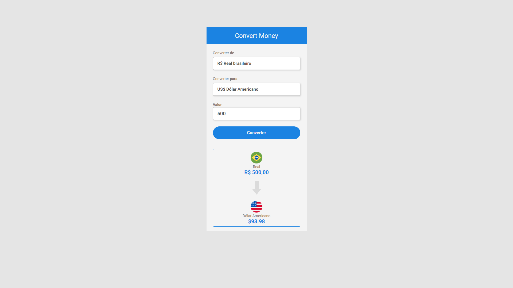

# Money Converter

### What does this application do? / O que essa aplicação faz?

This application shows to user the current value his receive if he convert money from Brazilian Real(BRL) to three others currencies(American Dolar - USD, European Euro - EUR and Virtual Bitcoin - BTC).
 
Este aplicativo mostra ao usuário o valor atual que ele recebe se ele converter dinheiro do real brasileiro (BRL) para três outras moedas (Dólar Americano - USD, Euro Europeu - EUR e Bitcoin Virtual - BTC). 
 
 

> Money Converter's Interface/ Interface do Money Converter

### Click at link below to see it working! / Clique no link abaixo para vê-lo funcionando!
<a href="https://yurimayk.github.io/CONVERTERPROJECT/">Clique aqui!</a>

### Project steps/Etapas do Projeto

The project is still under development. Below are the current definitions of performed tasks and upcoming updates:
 
O projeto ainda está em desenvolvimento. Abaixo estão as definições atuais de tarefas executadas e atualizações futuras:

- [x] Create HTML/Criar estrutura HTML;
- [x] Create CSS/Estilização com CSS;
- [x] Layout Update/Atualizar o Layout;
- [x] Add JavaScript/Adicionar JavaScript;
- [x] Put the project online/Colocar o projeto online;
- [x] Add CSS to 'money convert' to create a responsive design / Adicionar CSS ao 'Money Convert', para criar um desing responsivo;
- [ ] Add NodeJS/ Adicionar NodeJS.

## 🤝 Contributors/Colaboradores

We thank the following people who contributed to this project:
 
Agradecemos às seguintes pessoas que contribuíram para este projeto:

<table>
  <tr>
    <td align="center">
      <a href="#">
         
        
          <a href="https://www.linkedin.com/in/yurimayk/" target="_blank"><b>Yuri Medeiros</b></a>
        
      </a>
    </td>
    <td align="center">
      <a href="#">
         
        
          <a href="https://www.linkedin.com/in/rodolfomori/" target="_blank"><b>Rodolfo Mori</b></a>
        
      </a>
    </td>
</table>

[⬆ Voltar ao topo](#nome-do-projeto) 
